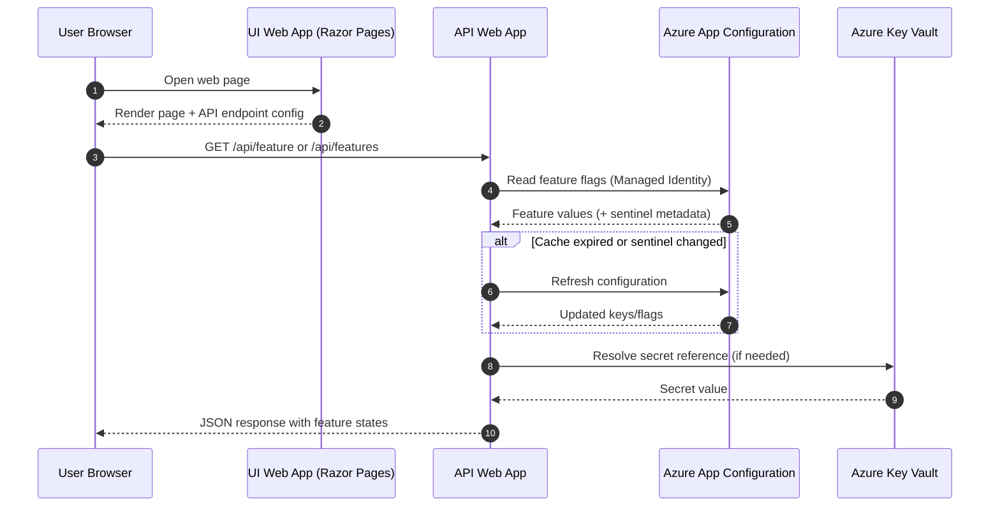

# Azure App Configuration Demo

This sample creates a .NET solution with a UI (Razor Pages) and a Backend (ASP.NET Core API). The backend uses Azure App Configuration for Feature Flags, and sensitive settings are retrieved via Azure Key Vault references at deployment. Terraform provisions all Azure resources, and a GitHub Actions workflow deploys infra and apps.

## Structure
- src/Ui: ASP.NET Core Razor Pages UI
- src/Api: ASP.NET Core Web API using Feature Flags
- terraform/: Azure infrastructure (App Configuration, Key Vault, Linux Web Apps, RG)
- .github/workflows/deploy.yml: CI/CD for Terraform + App deployments

## Runtime Sequence Diagram


## Prerequisites
- Azure subscription and Service Principal creds for CI (`AZURE_CREDENTIALS`)
- GitHub Actions runner permissions

## Deploy
1. Configure repository secret `AZURE_CREDENTIALS` with Service Principal JSON (from `az ad sp create-for-rbac`).
2. Push to `main` or run the `Deploy` workflow manually.
3. Workflow runs Terraform to provision infra, then builds and deploys UI and API.

## Local Run
```bash
dotnet run --project src/Api/AzureAppConfiguration.Api
dotnet run --project src/Ui/AzureAppConfiguration.Ui
```
# AzureAppConfiguration
Enabling application features using Azure App Configuration
